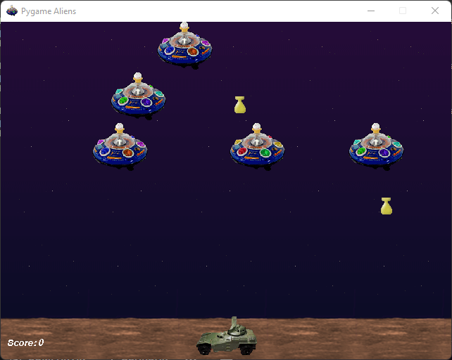

# Pygame 
<p align = "center">

</p>

Si uno quiere desarrollar juegos sencillos. Sencillos me refiero como juegos en 2D no un *Mortal Kombat X*, tal vez un *Mortal Kombat 1 del 1992*. Sí es la desventaja de *Pygame*. Sin embargo, hay cosas curiosas que se puede hacer con *Pygame*. Al igual que *RenPy* usa manejo de Sprites pero de una manera que puedas programarlo por tu cuenta y no tanto que lo haga *RenPy* por ti.

## Instalación.
1. **Windows**. Solamente se tiene que escribir el siguiente comando:

    ```python
        py -m pip install  -U pygame --user
    ```
    O también
    ```python
        pip3 install pygame --user
    ```
    Para comprobar que sí se instaló correctamente se debe poner este comando como de prueba.
    
    ```python
        py -m pygame.examples.aliens
    ```

    <p align = "center">
    
    </p>

2. **MacOs**. 

    ```python
        python3 -m pip install -U pygame --user
    ```
    Para **Anaconda**:
    ```python
        pythonw

    ```
    En vez de:
    ```python
        python

    ```
3. **Linux**
    - Debian/Ubuntu/Mint
    ```python
        sudo apt-get install python3-pygame
    ```
    - Fedora/Red hat.
    ```python
        sudo yum install python3-pygame
    ```
    - OpenSUSE
    ```python
        sudo yum install python3-pygame
    ```
    - Arch/Manjaro
    ```python
        sudo pamac install python-pygame
    ```
## Temario Pygame.
1. ¿Qué es Pygame?
    - Instalación (Ver la parte superior del Temario).
    - Documentación oficial.
    - Algunos proyectos con Pygame.(DeltaPython).
2. Primeros pasos con Pygame.
    - Importación del módulo.
    - Módulo sys.
    - Método init.
    - ¿Qué es FPS? Inicilización en el juego.
    - Time - Clock.
3. Screen y objetos.
    - Colores RGB.
    - Configuación de pantalla del juego.
        - set_display.
    - Background y titulo.
    - Creción de objetos (lineas, rectángulos, circulos).
        - for-loop.
4. Eventos.
    - Registro de eventos en txt.
    - Registro de eventos en pantalla (método *render*).
    - Método *get_rect*, *flip*.
    - Animaciones sencillas.
        - Movimiento de sprites.
        - Método *keydown*.
        - Colisiones.
    - Creación de mini videojuego (Dino - Chrome).
5. Programación Orientada a Objetos y sprites.
    - Recordatorio de POO en Python.
        - Clases y objetos.
        - Estancias.
        - Método Init.
    - Creación de animaciones con POO.
        - Jugador (Creación de animación).
        - Background (Creación de animación).
        - Aplicaciones con *mouse* y *keyboard*.
    - Creación de juegos de carros (sencillo).
    - Agregando sonido.
        - Formatos.
        - Loop.

## Fuentes de información 📕👓.
- [Pygame-Tutorials](https://www.pygame.org/wiki/tutorials).
- [Repository Pygame tutorial (spanish)](https://github.com/Patataman/PythonBasic/tree/master/frameworks/pygame).
- [CodersLegacy (English)](https://coderslegacy.com/python/python-pygame-tutorial/).
- [Mundo Python(Español)](https://github.com/mundo-python/pygame-Scripts).
- [BuilwithPython (English)](https://www.youtube.com/c/buildwithpython).
- [Code Bucket (English)](https://www.youtube.com/watch?v=wnBGG7JLrkg).